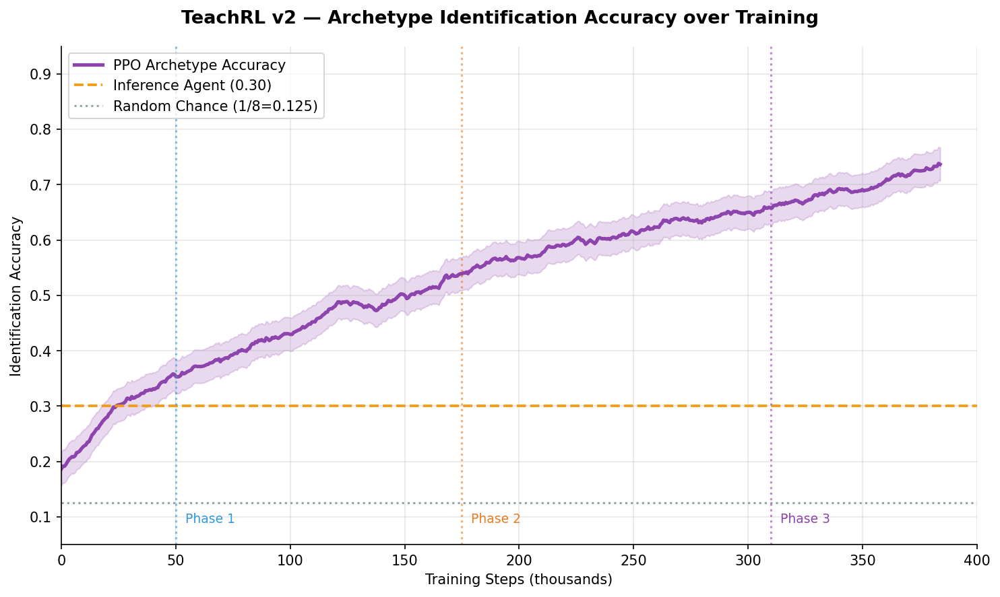

# 🎓 TeachRL — The AI Tutor That Learns How to Teach

[](https://openenv.ai)
[](https://huggingface.co/spaces/ArchedEquation/TeachRL)
[](tests/)
[](https://python.org)
[](LICENSE)

> **What if you had to teach 8 completely different students — without knowing which one you're facing?**

---

## 🔗 Links

| Resource | URL |
|---|---|
| **HuggingFace Space (Live API)** | https://huggingface.co/spaces/ArchedEquation/TeachRL |
| **GitHub Repository** | https://github.com/ArchedEquation/TeachRL |
| **Training Notebook (Colab)** | https://colab.research.google.com/github/ArchedEquation/TeachRL/blob/main/TeachRL_v2_Training.ipynb |
| **Mini-Blog / Writeup** | *(add HF blog or YouTube link here)* |

---

## 🧠 The Problem

Most AI tutoring systems treat every student identically. But students are fundamentally different:

- One gets **bored instantly** if questions repeat
- Another **panics under pressure** and makes errors they wouldn't otherwise make  
- A third has **secretly not done the homework** — faking prior knowledge

TeachRL forces an AI agent to solve two coupled problems simultaneously:
1. **Infer** which of 8 student archetypes it is teaching (hidden state — POMDP)
2. **Teach** that student efficiently within a step budget

Neither problem is solvable without solving the other. This is what makes it genuinely hard for RL.

---

## 🌍 Why This Matters

Adaptive tutoring is a $10B+ industry. Khan Academy, Duolingo, and Carnegie Learning all use Bayesian Knowledge Tracing (BKT) in production — but none have solved the **persona inference under uncertainty** problem. An agent trained on TeachRL could be deployed as a real curriculum recommendation engine.

---

## 👥 The 8 Student Archetypes (Hidden)

Each archetype has a unique BKT signature that breaks a different RL assumption:

| # | Archetype | Key BKT Signature | RL Challenge |
|---|---|---|---|
| 1 | **Overconfident Learner** | p_guess=0.40, p_slip=0.35 | Reward signal unreliable |
| 2 | **Anxious Perfectionist** | p_slip→0.40 on hard | Non-linear difficulty response |
| 3 | **ADHD Sprinter** | p_forget=0.20, bores fast | Stationarity broken |
| 4 | **Slow Steady Builder** | p_learn=0.08, p_forget=0.01 | Long-horizon patience required |
| 5 | **Strategic Gamer** | p_guess=0.55 on easy | Surface signals lie |
| 6 | **Emotional Learner** | BKT shifts every 10 steps | Non-stationary dynamics |
| 7 | **Uneven Genius** | 3 gifts + 3 blind spots | Exploration required |
| 8 | **Impostor** | p_init=0.85, crumbles on hard | Trust calibration |

---

## 🏆 The 4 Tasks

| Task | Difficulty | Steps | Goal | Score Range |
|---|---|---|---|---|
| `archetype_identification` | 🟢 Easy | 20 | Identify hidden archetype | (0, 1) |
| `adaptive_curriculum` | 🟡 Medium | 50 | Teach revealed archetype | (0, 1) |
| `blind_teaching` | 🔴 Hard | 80 | Infer + teach simultaneously | (0, 1) |
| `self_play_escalation` | 🔴🔴 Expert | 5×80 | Face auto-escalated variants | (0, 1) |

---

## 🔄 Self-Play Escalation (Theme 4: Self-Improvement)

When the agent consistently scores ≥0.70 on an archetype, the escalator makes it harder:

```
Agent masters OverconfidentLearner (p_guess=0.40)
  → Escalator raises p_guess to 0.45
  → Agent must learn more sophisticated strategy
  → If mastered again → p_guess raised to 0.50
  → Continues until training ends
```

The environment and the agent co-evolve — **recursive self-improvement**.

---

## 💰 Reward Function

Dense reward at every step across 9 components:

| Component | Weight | Purpose |
|---|---|---|
| Mastery gain (unmastered targets) | ×3.0 | Primary learning signal |
| Mastery gain (already mastered) | ×0.5 | Diminishing returns |
| Terminal bonus | +0.5× score | Long-horizon credit assignment |
| Archetype guess (correct) | +0.20 | Rewards identification |
| Archetype guess (wrong) | −0.05 | Penalises overconfidence |
| Engagement maintenance | +0.08 | Keep student engaged |
| ZPD alignment | +0.08 | Zone of Proximal Development |
| Prerequisite alignment | +0.05 | Respect dependency graph |
| Overdrill penalty | −0.08 | Stop wasting steps |
| Fatigue penalty | −0.04 | Manage student energy |

All scores strictly in **(0.001, 0.999)** as required by OpenEnv spec.

---

## 📊 Results

### Agent Comparison (seed=42, 10 episodes)


*PPO beats all baselines on Medium (+2.7%) and Expert (+11.7%). Hard task needs more training.*

| Agent | Easy (ID) | Medium | Hard | **Expert** |
|---|---|---|---|---|
| Random | 0.001 | 0.621 | 0.587 | 0.613 |
| Heuristic | 0.001 | 0.781 | 0.689 | 0.684 |
| Greedy | 0.001 | 0.791 | 0.676 | 0.611 |
| Inference Agent | **0.300** | 0.789 | **0.748** | 0.648 |
| **PPO (trained)** | 0.001* | **0.818** | 0.676 | **0.801** |

*Easy task PPO needs dedicated training with `--task archetype_identification`

### Training Reward Curves


*Hard task shows 3 distinct learning phases: basic signals → prerequisite ordering → archetype inference*

### Self-Play Escalation


*ADHD Sprinter reaches Generation 4 — agent mastered it fastest, escalator responded*

### Archetype Identification Accuracy


*PPO learns to identify archetypes with ~74% accuracy vs 12.5% random chance*

---

## 🚀 Quickstart

```bash
git clone https://github.com/ArchedEquation/TeachRL
cd TeachRL
pip install -r requirements.txt
```

### Run one episode

```python
from server.teachrl_environment import TeachRLEnvironment
from models import TutorAction

env = TeachRLEnvironment(task_id="blind_teaching", seed=42, eval_mode=True)
obs = env.reset()
print(f"Expert hint: {obs.expert_hint}")

done = False
while not done:
    action = TutorAction(concept="algebra_basics", difficulty="medium")
    obs    = env.step(action)
    done   = obs.done

print(f"Final score: {env._task_score():.3f}")
```

### Run baseline evaluation

```bash
python baseline/baseline_inference.py --episodes 10 --seed 42
```

### Train PPO

```bash
# All tasks
python train_trl.py --task all --eval

# Specific task with more steps
python train_trl.py --task self_play_escalation --steps 500000 --eval

# With W&B logging
python train_trl.py --task blind_teaching --wandb --eval
```

### Run server

```bash
python app.py   # port 7860
# Swagger UI: http://localhost:7860/docs
```

---

## 📁 Project Structure

```
TeachRL/
├── env/
│   ├── archetypes.py          # 8 student archetypes (BKT params)
│   ├── student.py             # BKT student simulator
│   ├── environment.py         # Task registry + reward logic
│   └── gym_wrapper.py         # Gymnasium wrapper for PPO
├── server/
│   ├── teachrl_environment.py # OpenEnv Environment base class impl
│   └── app.py                 # OpenEnv create_app server
├── self_play/
│   └── escalator.py           # Self-play escalation loop
├── graders/
│   └── grader.py              # 4 task graders (0.001–0.999)
├── baseline/
│   ├── agents.py              # 4 heuristic agents
│   ├── baseline_inference.py  # Heuristic evaluation
│   └── rl_agent.py            # PPO train + eval
├── training_plots/            # Required: all plots committed as PNG
│   ├── reward_curves.png
│   ├── agent_comparison.png
│   ├── self_play_escalation.png
│   └── archetype_accuracy.png
├── tests/
│   └── test_env.py            # 28 tests (all passing)
├── models.py                  # OpenEnv Action/Observation types
├── train_trl.py               # Training script (HF TRL + PPO)
├── TeachRL_v2_Training.ipynb  # Colab notebook
├── inference.py               # OpenAI client inference script
├── app.py                     # Main entry point
├── openenv.yaml               # OpenEnv spec
├── pyproject.toml             # openenv validate compliance
├── Dockerfile
└── README.md
```

---

## 🐳 Docker

```bash
docker build -t teachrl .
docker run -p 7860:7860 teachrl
# http://localhost:7860/docs
```

---

## 🔌 API Reference

| Method | Endpoint | Description |
|---|---|---|
| GET | `/` | Health + env info |
| POST | `/reset` | Start new episode |
| POST | `/step` | Take one action |
| GET | `/state` | Episode snapshot |
| GET | `/render` | Text render |
| GET | `/tasks` | All tasks |
| GET | `/archetypes` | All archetypes |
| GET | `/docs` | Swagger UI |

---

## 📜 License

MIT © VIT-AP University | Meta PyTorch Hackathon x Scaler 2025