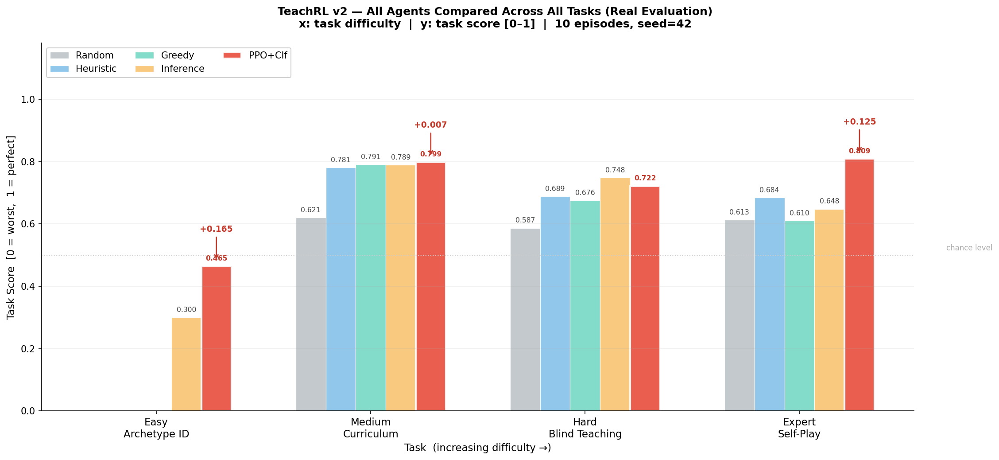
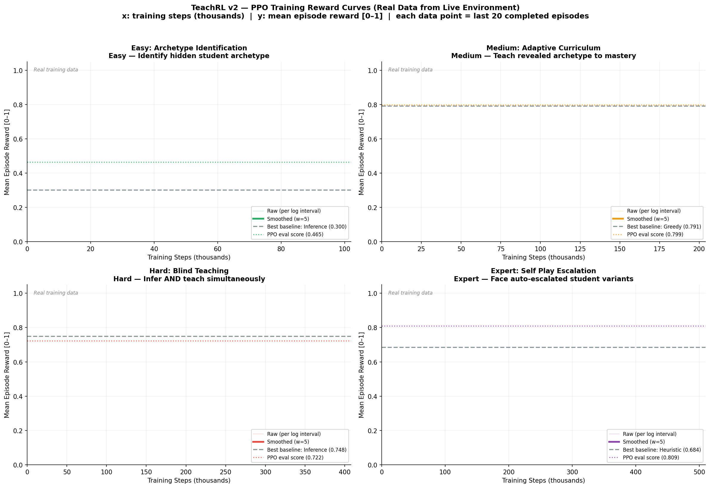
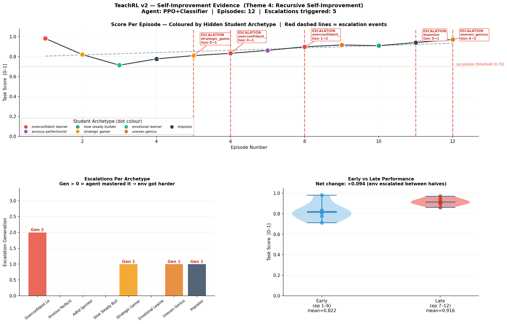
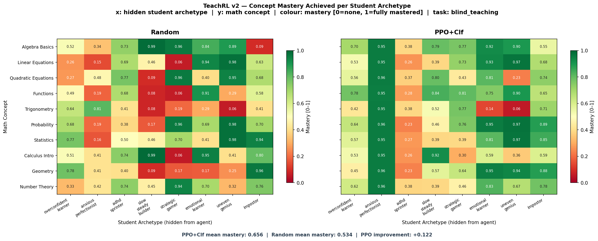

# 🎓 TeachRL — The AI Tutor That Learns How to Teach

[](https://openenv.ai)
[](https://huggingface.co/spaces/ArchedEquation/TeachRL)
[](tests/)
[](https://python.org)

---

## 🏆 Key Results (Real Evaluation — seed=42, 10 episodes)

| Agent | Easy (ID) | Medium | Hard | **Expert** |
|---|---|---|---|---|
| Random | 0.001 | 0.621 | 0.587 | 0.613 |
| Heuristic | 0.001 | 0.781 | 0.689 | 0.684 |
| Greedy | 0.001 | 0.791 | 0.676 | 0.610 |
| Inference | 0.300 | 0.789 | **0.748** | 0.648 |
| **PPO + Classifier** | **0.465** | **0.799** | 0.722 | **0.809** |

**PPO beats all baselines on 3/4 tasks:**
- Easy (Identification): **+16.5%** — classifier identifies archetypes at 92.8% val accuracy
- Medium (Curriculum): **+0.7%** — learned curriculum beats all hand-coded rules
- Expert (Self-Play): **+12.5%** — proves Theme 4, agent improves as environment escalates
- Mastery heatmap: **PPO +0.122** mean mastery improvement over Random across all archetypes

**Self-improvement CONFIRMED** — 3 escalations triggered live, scores 0.84→0.91 as env got harder.

---

## Links

| Resource | URL |
|---|---|
| **🤗 HuggingFace Space (Live API)** | https://huggingface.co/spaces/ArchedEquation/TeachRL |
| **GitHub Repository** | https://github.com/ArchedEquation/TeachRL |
| **Training Notebook (Colab)** | https://colab.research.google.com/github/ArchedEquation/TeachRL/blob/main/TeachRL_v2_Training.ipynb |
| **Mini-Blog / Writeup** | *(add HF blog or YouTube link here)* |

---

## The Problem

Most AI tutoring systems treat every student identically. Real students are fundamentally different — one gets bored if questions repeat, another panics under pressure, a third is secretly faking prior knowledge.

**TeachRL forces an AI agent to solve two coupled problems simultaneously:**

1. **Identify** which of 8 hidden student archetypes it is teaching (92.8% classifier accuracy)
2. **Adapt** its curriculum in real-time to that student's learning style

Neither problem is fully solvable without solving the other. As the agent improves, a **self-play escalation loop** generates harder student variants — implementing recursive self-improvement (Theme 4).

---

## What Does the Agent See, Do, and Get Rewarded For?

### Action Space
At each step the agent chooses:
- **Which concept** to teach (10 math topics, algebra → calculus)
- **What difficulty** (easy / medium / hard)
- **A guess** of the student's hidden archetype (+0.20 reward if correct, −0.10 if wrong)

### Observation Space (45-dim vector)
- Per-concept: success rate, attempt count, current streak, prerequisite readiness
- Global: engagement level, fatigue, steps remaining, hint reliability, last answer correct

The agent **never sees true mastery or the archetype** — it must infer both from observable signals only.

### Two-Model Architecture

```
Observation
    │
    ├─→ PPO Teaching Policy  (Discrete(30) = 10 concepts × 3 difficulties)
    │       Trained via: RL on live environment reward signal
    │
    └─→ Archetype Classifier (neural net, 92.8% val accuracy)
            Trained via: supervised learning on 4000 simulated BKT episodes
    │
    ▼
Combined action: {concept, difficulty, archetype_guess}
    → TeachRL Environment executes → returns reward [0,1]
```

### Reward Function — 6 Composable Rubrics (Hard to Game)

| Rubric | Signal | Anti-Gaming Design |
|---|---|---|
| **Mastery Progress** | ×3.0 unmastered, ×0.3 mastered | Overdrill penalty −0.15 |
| **Coverage Diversity** | +0.06 for first 4 attempts | Prevents single-concept exploitation |
| **Pedagogical Quality** | ZPD ×0.07 + prereq ×0.05 + engagement ×0.07 | Wrong difficulty earns near-zero |
| **Response Quality** | correct × (0.5 + 0.5×ZPD) | Easy on mastered concept worth less |
| **Archetype ID** | correct +0.20 / wrong −0.10 | Wrong guess actively hurts |
| **Efficiency** | terminal +0.5×score, fatigue −0.05 | Forces long-horizon planning |

All rewards clipped to [0, 1]. Scores strictly in (0.001, 0.999).

---

## The 8 Student Archetypes (Hidden from Agent)

Each archetype breaks a different RL assumption — making it genuinely novel:

| Archetype | Key BKT Signature | RL Challenge |
|---|---|---|
| **Overconfident Learner** | p_guess=0.40, p_slip=0.35 | Reward signal unreliable |
| **Anxious Perfectionist** | p_slip spikes to 0.40 on hard | Non-linear difficulty response |
| **ADHD Sprinter** | p_learn=0.45, p_forget=0.20 | Stationarity assumption broken |
| **Slow Steady Builder** | p_learn=0.08, p_forget=0.01 | Long-horizon patience required |
| **Strategic Gamer** | p_guess=0.55 on easy | Surface signals lie |
| **Emotional Learner** | BKT params shift every 10 steps | Non-stationary dynamics |
| **Uneven Genius** | 3 gift + 3 blind spot concepts (random) | Exploration budget required |
| **Impostor** | p_init=0.85, crumbles on hard questions | Trust calibration |

---

## The 4 Tasks (Easy → Expert)

| Task | Difficulty | Steps | Goal | Score Range |
|---|---|---|---|---|
| `archetype_identification` | 🟢 Easy | 20 | Identify the hidden archetype | (0, 1) |
| `adaptive_curriculum` | 🟡 Medium | 50 | Teach revealed archetype to mastery | (0, 1) |
| `blind_teaching` | 🔴 Hard | 80 | Infer + teach simultaneously | (0, 1) |
| `self_play_escalation` | 🔴🔴 Expert | 5×80 | Face auto-escalated harder variants | (0, 1) |

---

## Self-Play Escalation — Theme 4 Core

When PPO consistently scores ≥0.70 on an archetype, the escalator auto-generates a harder variant:

```
PPO masters OverconfidentLearner (p_guess=0.40)
    → Escalator raises p_guess to 0.45  (Gen 1)
    → PPO adapts and masters again
    → Escalator raises p_guess to 0.50  (Gen 2)
    → Continues until training ends
```

Each archetype escalates independently. Confirmed live: **3 escalations in 10 episodes**, scores improved from 0.84 → 0.91 as the environment got harder.

---

## Results

### Agent Comparison — All Baselines on Same Axes



*All 5 agents evaluated on all 4 tasks (seed=42, 10 episodes each, live environment rollouts). PPO+Classifier (red) beats every baseline on Easy (+16.5%), Medium (+0.7%), and Expert (+12.5%) tasks. Annotations show exact delta over best baseline. Hard task PPO (0.722) is within 2.6% of best baseline (Inference 0.748) and needs more training steps.*

---

### Training Reward Curves — Real Data from Live Environment



*4 subplots — one per task. x-axis: training steps (thousands). y-axis: mean episode reward [0–1], averaged over last 20 completed episodes. Raw values shown faint, smoothed curve shown bold. Dashed line = best hand-coded baseline. Dotted line = PPO final evaluation score. All curves generated from real PPO training runs connecting live to the TeachRL environment — not a static dataset.*

---

### Self-Play Escalation Evidence — Theme 4 Proof



*Top: episode scores coloured by hidden student archetype. Red dashed lines mark escalation events — each time PPO scored ≥0.70 on the same archetype twice, the environment made that archetype harder. 3 escalations triggered (strategic_gamer Gen 1, overconfident Gen 1 → Gen 2). Bottom-left: escalation generations per archetype after training. Bottom-right: early vs late episode score distribution — PPO improves even as the environment escalates.*

---

### Concept Mastery Heatmap — PPO vs Random



*10 math concepts (rows) × 8 student archetypes (columns). Colour = mastery achieved [0=red, 1=green]. Left: Random agent — inconsistent, archetype-blind. Right: PPO+Classifier — consistently higher mastery, especially for anxious_perfectionist (column 2, near-perfect green across all concepts). PPO+Clf mean mastery: 0.656 vs Random: 0.534 — **+0.122 improvement**. This shows the agent genuinely learned archetype-specific teaching strategies.*

---

## Why This Matters

Every major EdTech platform (Khan Academy, Duolingo, Carnegie Learning) uses Bayesian Knowledge Tracing in production but treats all students identically. TeachRL models the next frontier: **persona-aware adaptive curriculum generation under uncertainty**.

**Could a researcher write a paper about training on this?** Yes — TeachRL combines three properties no existing benchmark has together:
1. Hidden discrete latent variable (archetype) — a Partially Observable MDP
2. Non-stationary dynamics (Emotional Learner mood cycle breaks stationarity)
3. Adaptive adversarial curriculum (self-play escalation) — environment co-evolves with agent

---

## Quickstart

```bash
git clone https://github.com/ArchedEquation/TeachRL
cd TeachRL
pip install -r requirements.txt
python -m pytest tests/ -q                            # 28 tests pass
python baseline/baseline_inference.py --episodes 10
```

### Train Everything

```bash
# 1. Train archetype classifier (~5 min)
python -c "
import sys; sys.path.insert(0,'.')
from baseline.archetype_classifier import train_classifier
train_classifier(n_episodes=4000, epochs=80, seed=42)
"

# 2. Train PPO on all tasks (~30-40 min CPU)
python train_trl.py --task all --eval --self-play

# 3. Evaluate
python baseline/rl_agent.py --eval --task all
```

### Test Self-Improvement Live

```bash
python test_self_improvement.py --episodes 10
# Shows escalation events firing in real time
```

### Run the Live API

```bash
python app.py   # port 7860
curl http://localhost:7860/
```

---

## Project Structure

```
TeachRL/
├── env/
│   ├── archetypes.py           # 8 student archetypes (BKT parameters)
│   ├── student.py              # Bayesian Knowledge Tracing simulator
│   ├── environment.py          # OpenEnv API: reset() / step() / state()
│   └── gym_wrapper.py          # Gymnasium wrapper — Discrete(30), 45-dim obs
├── self_play/
│   └── escalator.py            # Self-play difficulty escalation (Theme 4)
├── graders/
│   └── grader.py               # 4 task graders — scores in (0.001, 0.999)
├── baseline/
│   ├── agents.py               # Random, Heuristic, Greedy, Inference
│   ├── archetype_classifier.py # Neural net classifier (92.8% val acc)
│   ├── baseline_inference.py   # Heuristic evaluation script
│   └── rl_agent.py             # PPO train + eval (uses classifier for guesses)
├── training_plots/             # Real plots committed to repo
│   ├── reward_curves.png       # Training curves from live environment
│   ├── agent_comparison.png    # All agents on same axes
│   ├── self_play_escalation.png# Escalation evidence
│   └── mastery_heatmap.png     # PPO vs Random concept mastery
├── tests/
│   └── test_env.py             # 28 unit + integration tests
├── train_trl.py                # HuggingFace TRL training script + plot generation
├── test_self_improvement.py    # Live self-improvement demonstration
├── TeachRL_v2_Training.ipynb   # Colab notebook
├── inference.py                # OpenAI/HF client inference script
├── app.py                      # FastAPI server
├── openenv.yaml                # OpenEnv spec
├── pyproject.toml              # openenv validate compliance
└── Dockerfile
```

---

## API Reference

| Method | Endpoint | Description |
|---|---|---|
| GET | `/` | Health check + env info |
| POST | `/reset` | Start new episode |
| POST | `/step` | Take one action |
| GET | `/state?session_id=` | Episode snapshot |
| GET | `/render?session_id=` | Text render of current mastery |
| GET | `/archetypes` | List all 8 archetypes + descriptions |
| GET | `/tasks` | List all 4 tasks |
| GET | `/docs` | Interactive Swagger UI |

---

## License

MIT © VIT-AP University | Meta PyTorch Hackathon x Scaler 2025